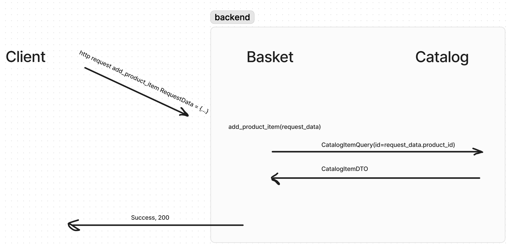
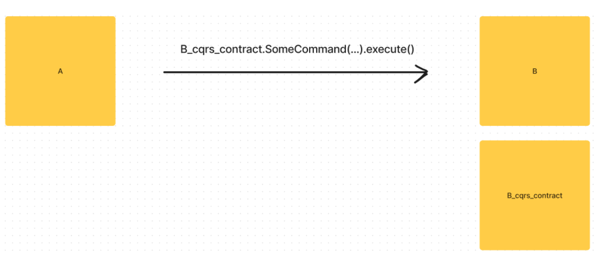
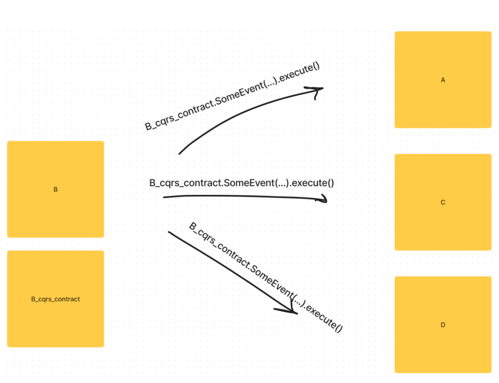

# Contract resolution

Представим, что мы разрабатываем интернет магазин и у нас есть два сервиса: **basket** и **catalog**
В **basket** лежит информация о корзине пользователя, в **catalog** информация о товарах в нашем магазине
Представим, что в нашей реализации мы разделяем запросы на _Query_, _Command_ и _Event_ (_cqrs_).
Пусть контракт, который поставляет сервис **catalog**, находится в отдельном пакете **catalog_cqrs_contract**

В сервисе **basket** реализован http эндпоинт добавление товара в корзину. При этом frontend присылает только идентификатор этого товара. Соответственно цену (_price_) сервис **basket** должен запросить у сервиса **catalog** при помощи квери _CatalogItemQuery_ (опустим момент, что при такой реализации у нас появляется зависимость у **basket** от **catalog**, в рамках этого проекта это неважно абсолютно)



\* _код можно посмотреть, переключившись на коммит 08376187521b1a30b5ea4816d5b1c3061fd71a63_

Теперь представим, что внутри контекста **catalog** произошли изменения, и цена товара теперь обозначается, как _"unit_price"_, а не _price_. В таком случае сервис **_basket_** **больше не может работать** с сервисом **catalog**. Ведь он ожидает, что в ответ ему придет дто с атрибутом _"price"_, а не _"unit_price"_

**Вопрос:** Как быть уверенным в том, что basket умеет работать с catalog?
**Ответ:** Написать тесты на контракты!

Мы предоставляем доступ к квере **catalog_cqrs_contract.CatalogItmQuery** сервису **basket**. В сервисе **basket** мы хотим провалидировать, что мы умеем работать с этой кверей.
Умеем работать заключается в двух этапах:

1.  Интерфейс квери не поменялся
2.  В интерфейсе ответа есть то что нам нужно и оно имеет тот тип, который мы ожидаем

Напишем тест:

```python
# basket/pytests/pytest_cqrs_contract_usage.py

class TestCatalogItemQuery:
    def test_query_contract(self):
        assert hasattr(attrs.fields(CatalogItemQuery), 'id')
        assert attrs.fields(CatalogItemQuery).id.type == PositiveInt

    def test_query_response_contract(self):
        response_type = CatalogItemQuery.__response_type__()

        assert response_type == CatalogItemDTO

        assert CatalogItemDTO.model_fields.get('price', None) is not None
        assert CatalogItemDTO.model_fields['price'].annotation == float
```

\* _код можно посмотреть, переключившись на коммит aba034a49c398e5489d996f629117fded6335ad1_

**Важно!:**
Заметим, что мы написали тест **только** на атрибут "price", наличие атрибута "product_name" и его тип нас не интересует, т.к. в сервисе **basket** используется **только** атрибут "price". Соответсвенно, если завтра, атрибут "product_name" изменит свое наименование или пропадает вовсе - сервису "basket" все равно.

Добавим _pytest.mark_, чтобы можно запускать тесты контрактов перед любыми другими тестами (если в этом есть необходимость):

```python
# basket/pytests/pytest_cqrs_contract_usage.py


@pytest.mark.cqrs_contract_usage
class TestCatalogItemQuery:
    def test_query_contract(self):
        assert hasattr(attrs.fields(CatalogItemQuery), 'id')
        assert attrs.fields(CatalogItemQuery).id.type == PositiveInt

    def test_query_response_contract(self):
        response_type = CatalogItemQuery.__response_type__()

        assert response_type == CatalogItemDTO

        assert CatalogItemDTO.model_fields.get('price', None) is not None
        assert CatalogItemDTO.model_fields['price'].annotation == float
```

Теперь, мы можем запустить только тестирование контрактов при помощи `pytest -m cqrs_contract_usage`

**Итог:** без написания интеграционных тестов на покрытие всего и вся, мы, при помощи легковесных и быстрых тестов, научились понимать, когда отдельные сервисы находится в согласованном с друг другом состоянии, а когда нет.

---

**Вопрос:** В примере выше мы рассмотрели только один вид запроса - _Query_, как поступать с _Command_ и _Event_?

**Ответ:**

### Command:



Мы предоставляем доступ к команде B_cqrs_contract.SomeCommand сервису A. В сервисе A мы хотим провалидировать, что мы умеем работать с этой командой.
Умеем работать заключается в двух этапах:

1. Интерфейс команды не поменялся
2. В интерфейсе ответа есть то что нам нужно и оно имеет тот, который мы ожидаем (это только если используем синхронный запуск команды и ждем от нее ответа)

```python
# A/pytests/pytest_cqrs_contract_usage.py

class TestSomeCommand:

    def test_command_contract(self) -> None:
        assert_attribute(SomeCommand, 'some_attr', some_type)
        assert hasattr(attrs.fields(SomeCommand), 'some_attr')
        assert attrs.fields(CatalogItemQuery).some_attr.type == some_type

    def test_command_response_contract(self) -> None:
        response_type = SomeCommand.__response_type__()

        assert response_type == SomeResponseType

        assert SomeResponseType.model_fields.get('some_attr', None) is not None
        assert SomeResponseType.model_fields['some_attr'].annotation == some_type
```

### Event:



сервис **B** выпускает событие, на которое подписаны сервисы **A**, **C** и **D**
**Вопрос:** Когда мы будем знать, что система работает корректно?
**Ответ:** когда мы знаем, что:

1. **B** правильно публикует событие, интерфейс внутри кода публикации равен интерфейсу _B_cqrs_contract.SomeEvent_. Это проверка на уровне паблишера
2. Интерфейс _B_cqrs_contract.SomeEvent_ реализует интерфейс, который нужен каждому из подписчиков. Это проверка на уровне консьюмера

тест паблишера:

```python
# B/pytests/pytest_contract_usage.py

class TestSomeEvent:
    def test_event_contract(self) -> None:
        assert SomeEvent.model_fields.get('some_attr', None) is not None
        assert SomeEvent.model_fields['some_attr'].annotation == some_type

```

тест консьюмеров:  
 \* _(для простоты, предположим, что каждый из консюмиров использует только поле 'some_attr')_

```python

# A/pytests/pytest_contract_usage.py
class TestSomeEvent:
    def test_event_contract(self) -> None:
        assert SomeEvent.model_fields.get('some_attr', None) is not None
        assert SomeEvent.model_fields['some_attr'].annotation == some_type
```

```python

# B/pytests/pytest_contract_usage.py
class TestSomeEvent:
    def test_event_contract(self) -> None:
        assert SomeEvent.model_fields.get('some_attr', None) is not None
        assert SomeEvent.model_fields['some_attr'].annotation == some_type
```

```python

# C/pytests/pytest_contract_usage.py
class TestSomeEvent:
    def test_event_contract(self) -> None:
        assert SomeEvent.model_fields.get('some_attr', None) is not None
        assert SomeEvent.model_fields['some_attr'].annotation == some_type
```

---

Больше примеров и более продвинутую реализацию можно посмотреть в https://github.com/Rwwwrl/my_eshoponcontainer , в файлах \*\*/pytest_cqrs_contract_usage.py
